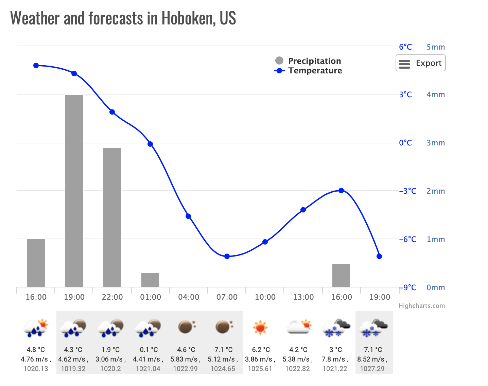

# OpenWeatherMap

OpenWeatherMap is an online service that provides weather data, including current weather data, forecasts, and historical data to the developers of web services and mobile applications. For data sources, it utilizes meteorological broadcast services, raw data from airport weather stations, raw data from radar stations, and raw data from other official weather stations. All data is processed by OpenWeatherMap in a way that it attempts to provide accurate online weather forecast data and weather maps, such as those for clouds or precipitation. Beyond that, the service is focused on the social aspect by involving weather station owners in connecting to the service and thereby increasing weather data accuracy. The ideology is inspired by OpenStreetMap and Wikipedia that make information free and available for everybody.

The weather related fields like Temeprature , precipitation are displayed by the OpenWeatherMap.

AIM:

Using OpenWeatherMap API to get weather data for cities and storing the same in the MongoDB and Use mongodb to create our own weathermap.

# Tech Implemented:

## Multithreading 

Multithreading is a type of execution model that allows multiple threads to exist within the context of a process such that they execute independently but share their process resources. A thread maintains a list of information relevant to its execution including the priority schedule, exception handlers, a set of CPU registers, and stack state in the address space of its hosting process.

## MongoDB

MongoDB is a cross-platform document-oriented database program. It is issued under the Server Side Public License (SSPL) version 1, which was submitted for certification to the Open Source Initiative but later withdrawn in lieu of SSPL version 2[6]. Classified as a NoSQL database program, MongoDB uses JSON-like documents with schemata. MongoDB is developed by MongoDB Inc..

# Functions Used:

## url_builder

Usewd to Build Various URL's so that it can be used for the fetch function.

## time_converter

The time fetched by the function using API is not in date-time format so inorder to convert it in the same the function is used.

## data_fetch

Then main work of this function is to fetch the data from the API 

## data_organizer

The fetch raw data is passsed on to the data_organizer function which arranges the data in Dictionary in a proper format.

## db_5
## db_16

Both the function access the MongoDB Collections inside the database and add data to it.

